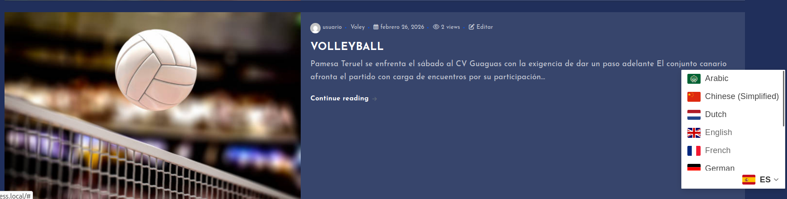

# Deportes Actualidad – Portal de Noticias Deportivas

**Deportes Actualidad** es un portal web creado con WordPress dedicado a ofrecer información, noticias y contenido relacionado con el mundo del deporte.  
El objetivo principal es proporcionar un sitio actualizado, organizado y fácil de navegar donde los usuarios puedan consultar artículos, categorías temáticas y diferentes secciones deportivas.

---

##  Descripción del proyecto

Este proyecto forma parte de la práctica de **Instalación y Configuración de WordPress**.  
He desarrollado un sitio web llamado **Deportes Actualidad**, pensado para reunir noticias deportivas de forma clara y accesible.

El portal incluye:

- Publicación de artículos deportivos
- Organización del contenido por categorías
- Secciones temáticas
- Buscador interno
- Mapa

---

##  Instalación y configuración

Para crear el portal seguí estos pasos:

### 1. Instalación del entorno LAMP
- **Apache** como servidor web  
- **MySQL** como base de datos  
- **PHP** para ejecutar WordPress  

### 2. Instalación de WordPress
- Descarga del paquete oficial
- Creación de la base de datos
- Configuración del archivo `wp-config.php`
- Instalación mediante el asistente web

### 3. Personalización del tema
Elegí un tema visual adecuado para un portal de noticias y lo personalicé modificando:

- Colores principales
- Tipografías
- Menú de navegación
- Página de inicio
- Widgets y estructura de las secciones

---

##  Organización del contenido

El contenido del portal está organizado en varias categorías deportivas para facilitar la navegación.  
Algunas de las categorías creadas son:

- **Fútbol**
- **Baloncesto**
- **Volley**
- **Noticias generales**
- **Opinión / Artículos destacados**
- **Secciones de Noticias**

También publiqué varias entradas de prueba con:

- Título
- Texto
- Imagen destacada
- Etiquetas
- Categorías

---

##  Funcionalidades implementadas

El sitio web incluye las siguientes funcionalidades:

### ✔️ Menú principal de navegación

### ✔️ Página de inicio personalizada

### ✔️ Pàgina de Portada

### ✔️ Pàgina de Contacte

### ✔️ Un mapa interactiu

### ✔️ Multilingüismeç

### ✔️ Extensions i Widgets

### ✔️ Personalització CSS

### ✔️ Publicación y gestión de entradas

### ✔️ Buscador interno

---

## Capturas de pantalla

Ejemplo:

 Enlace al portal
URL del sitio: http://wordpress.local

 Información adicional
Tecnología utilizada: WordPress sobre LAMP

Tipo de proyecto: Portal de noticias deportivas

Público objetivo: Aficionados al deporte que buscan información rápida y organizada
